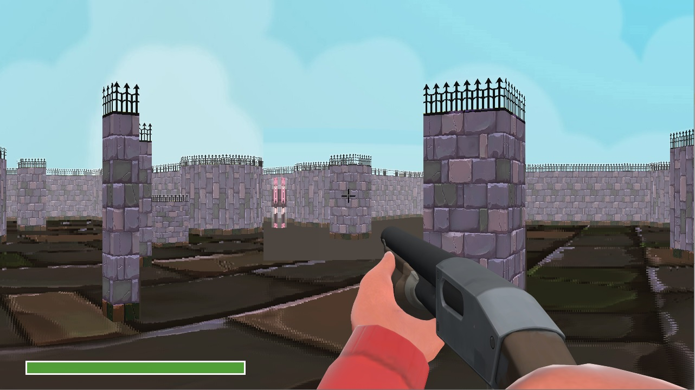
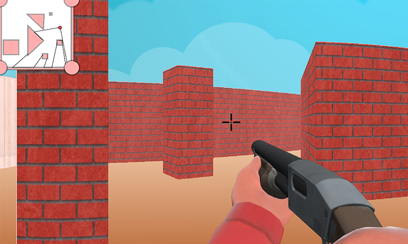
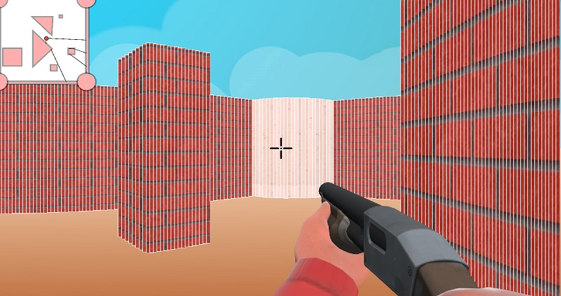
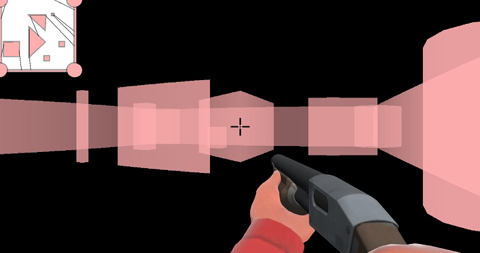
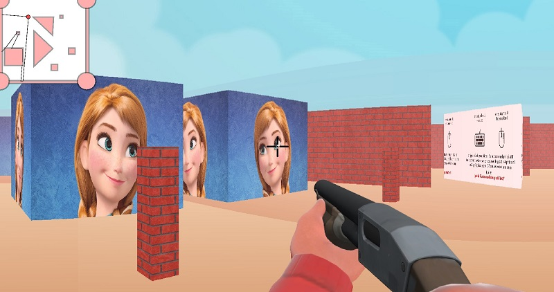
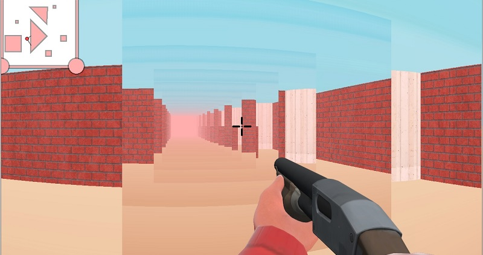
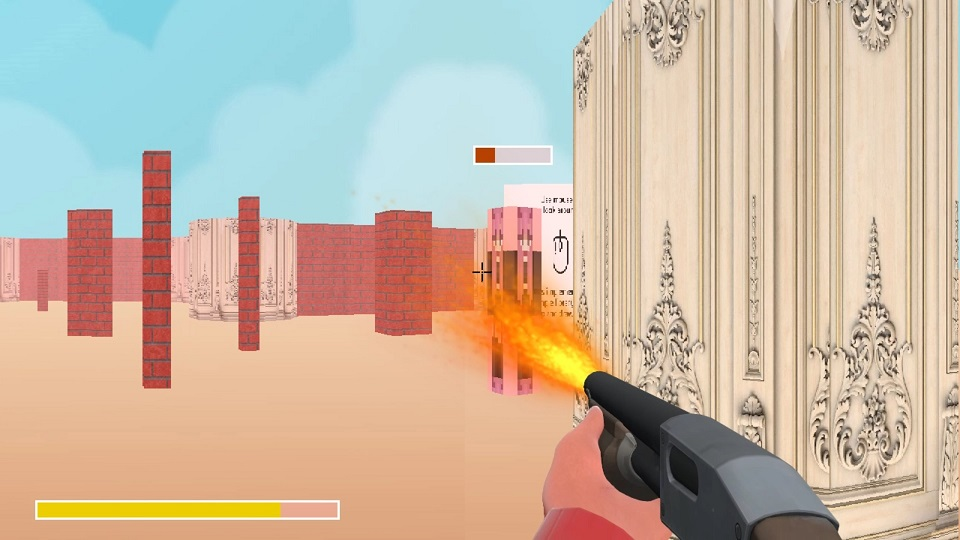

# pseudo3DEngine
Simple pseudo-3d engine implementation. This library allows you to make two dimensional map and draw pseudo 3D image  using Ray-Cast. 

Floor texturing (NEW):

Some results of texturing:

Demonstration of how does this engine work:

We also can switch off the textures: 

This engine can perfom some mirrors. As you can see, we get correct reflection image:

When we have two mirrors standing next to each other we can get the beautiful results: 

Online test:

